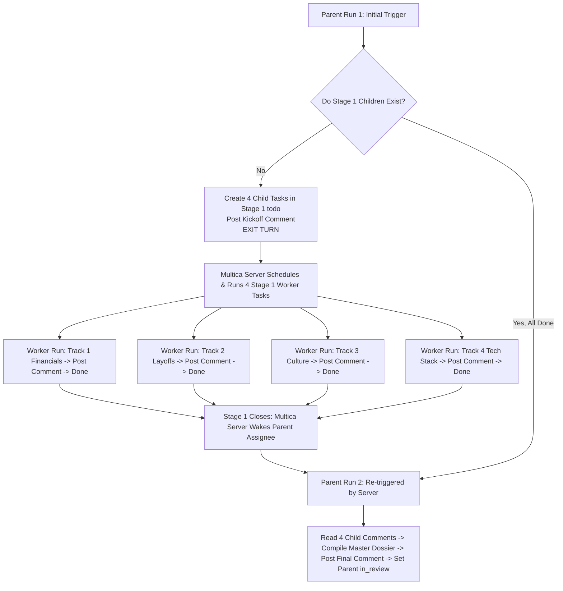

# Candidate Employer Deep Due Diligence Skill

A specialized, high-integrity research pipeline for high-stakes career transitions, offer evaluations, and executive/senior engineering moves. Enforces formal decoupled stage barriers across financial health, layoff vulnerability, operational culture, and technical architecture.

---

## 1. Core Invariants & Anti-Hallucination Guardrails

To protect candidates from joining distressed or toxic organizations, four non-negotiable invariants are enforced:

### 1. The Zero-Sugarcoating Invariant (Brutal Honesty)
- Corporate PR, self-published marketing blogs, sponsored "Best Places to Work" awards, and recruiter pitches are treated as **unverified claims ($cf = 0.10$)**.
- Red flags must **never be euphemized** (e.g., do not call "uncompensated 70-hour weeks" a "fast-paced entrepreneurial environment").
- High turnover, toxic management, or financial distress must be reported explicitly as a **Critical Risk**.

### 2. Strict Decoupling of Employer Health vs. Candidate Alignment
- **The Health Invariant**: The **Objective Employer & Role Health Scorecard** measures *only* factual business stability, financial runway, historical layoff risk, operating friction, and leadership sanity.
- **No Keyword / Fit Inflation**: Candidate skill overlap **must NEVER inflate or mask** company instability or poor culture.
- **Dual-Index Output**: Maintains two non-overlapping indexes:
  1. *Index 1: Objective Employer & Role Health (Macro Stability)*
  2. *Index 2: Candidate Match & Interview Positioning (Personal Alignment)*

### 3. Native Multica Stage Barrier Contract
- Sub-issues are **real units of decoupled execution**, not decorative checklists.
- **Stage Barrier Exemption Rule**: Creating child issues with `--stage 1 --status todo` and ending your turn is **NOT "background-and-yield"**. It is the native Multica platform contract. The Multica server backend automatically schedules the worker tasks and triggers a fresh run on this parent ticket when Stage 1 completes.
- **Prohibited**:
  - Doing all research in the parent turn when running a deep due diligence pipeline.
  - Creating child sub-issues directly in `done` status without posted comments/evidence.

### 4. The "Floor, Not Ceiling" Source Boundary
- Baseline inquiry categories are minimums; dynamically discover alternative high-signal sources when facing bot walls or paywalls (Google-indexed community snippets, SEC filings, WARN databases, Hacker News, Reddit `r/cscareerquestions`, `r/experienceddevs`).

---

## 2. Multi-Stage Lifecycle Execution Protocol (Multica Issue Environments)

When assigned a ticket to run deep due diligence on a company, determine your role in the lifecycle:



---

### Step 1: Parent Ticket First Trigger (Fan-Out Stage)
If you are running on the **parent issue** and `multica issue children <parent-id>` returns no child tasks:
1. Set parent issue to `in_progress`:
   ```bash
   multica issue status <parent-id> in_progress --no-start
   ```
2. Create the 4 Stage 1 worker child issues assigned to Mika (`016e40ea-e07d-486a-a641-0b1ca7b4cc3a`):
   ```bash
   multica issue create --title "Track 1: Financial & Business Health" --parent <parent-id> --project <project-id> --stage 1 --status todo --assignee-id 016e40ea-e07d-486a-a641-0b1ca7b4cc3a --description "Execute deep audit of company capitalization, ARR trajectory, funding history, and financial runway."
   multica issue create --title "Track 2: Layoff & Stability History" --parent <parent-id> --project <project-id> --stage 1 --status todo --assignee-id 016e40ea-e07d-486a-a641-0b1ca7b4cc3a --description "Audit Layoffs.fyi, state/provincial WARN notices, executive continuity, and target role origin."
   multica issue create --title "Track 3: Culture, WLB & Management Quality" --parent <parent-id> --project <project-id> --stage 1 --status todo --assignee-id 016e40ea-e07d-486a-a641-0b1ca7b4cc3a --description "Evaluate average working hours, on-call severity, psychological safety, and remote policy stability."
   multica issue create --title "Track 4: Role Scope & Architecture" --parent <parent-id> --project <project-id> --stage 1 --status todo --assignee-id 016e40ea-e07d-486a-a641-0b1ca7b4cc3a --description "Analyze technical stack health, architectural complexity, CI/CD maturity, and third-party integration friction."
   ```
3. Post a brief kickoff comment to the parent ticket:
   ```bash
   multica issue comment add <parent-id> --content "Stage 1 Fan-Out initialized. Dispatched 4 parallel worker sub-issues for Financial, Stability, Culture, and Architecture tracks. Yielding to Multica Stage Barrier."
   ```
4. **STOP AND END YOUR TURN IMMEDIATELY.** Do not perform research in this turn. The Multica server backend will dispatch the worker tasks.

---

### Step 2: Child Worker Tasks (Parallel Execution)
When you are invoked on a **child issue** (e.g. `Track 1`, `Track 2`, `Track 3`, or `Track 4`):
1. Execute deep, targeted research for **your assigned pillar only**.
2. Save full findings, verified data points, metrics, and source URLs to `./findings.md`.
3. Post the evidence payload directly as a comment to your child issue:
   ```bash
   multica issue comment add <child-id> --content-file "./findings.md"
   multica issue status <child-id> done --no-start
   rm ./findings.md
   ```
4. End your turn.

---

### Step 3: Parent Ticket Second Trigger (Fan-In & Synthesis)
When you are invoked on the **parent issue** and `multica issue children <parent-id>` shows all 4 Stage 1 child issues are `done`:
1. Read the comment history of each child issue:
   ```bash
   multica issue comment list <child-1-id> --output json
   multica issue comment list <child-2-id> --output json
   multica issue comment list <child-3-id> --output json
   multica issue comment list <child-4-id> --output json
   ```
2. Ingest the 4 evidence payloads and compile the **Master Employer Due Diligence Dossier** using the anchored rubrics below.
3. Save the dossier to `./master_dossier.md` and post it to the parent issue:
   ```bash
   multica issue comment add <parent-id> --content-file "./master_dossier.md"
   multica issue status <parent-id> in_review --no-start
   rm ./master_dossier.md
   ```
4. End your turn.

---

## 3. The 4 Specialized Research Pillars & Minimum Baselines

### Pillar 1: Financial Viability & Business Health
*Goal: Determine if the company has the financial runway and business momentum to sustain long-term employment.*
- **Public**: Latest SEC 10-K / 10-Q (revenue, margins, cash flow, debt, risk disclosures).
- **Private**: Crunchbase / PitchBook funding rounds, lead VC backers, valuation history, estimated ARR, employee headcount trajectory.
- **Revenue Model**: Customer concentration, macroeconomic sensitivity, B2B SaaS retention.

### Pillar 2: Employment Stability & Layoff Track Record
*Goal: Assess job security, organizational volatility, and leadership retention.*
- **Layoff History**: Query **Layoffs.fyi**, news archives, state/provincial **WARN Act notices** (past 36 months).
- **Restructuring Cadence**: C-suite turnover, department shutdowns, pivot frequency.
- **Hiring Context**: Is the target role a net-new strategic expansion, or a high-turnover backfill?

### Pillar 3: Culture, Work-Life Balance & Management Quality
*Goal: Uncover daily operational reality, on-call burdens, and employee psychological safety.*
- **Work Hours & On-Call**: Average weekly hours, after-hours paging frequency, on-call compensation.
- **Community Triangulation**: Reddit (`r/cscareerquestions`, `r/experienceddevs`), Levels.fyi reviews, Hacker News, Google-indexed discussions (`site:teamblind.com "<company>"`).
- **Flexibility & Policy Stability**: Return-to-office (RTO) stability vs. remote autonomy.

### Pillar 4: Role Scope, Tech Stack Health & Engineering Maturity
*Goal: Evaluate technical debt, engineering autonomy, tooling friction, and operational complexity.*
- **Tech Stack Maturity**: Core languages, frameworks, cloud infrastructure, CI/CD automated deployment, test coverage.
- **Operational Burden**: Fragile third-party API dependencies, microservice sprawl, legacy data synchronization friction.
- **Engineering Footprint**: GitHub org activity, engineering blogs, tech conference talks.

---

## 4. Anchored Quantitative Scoring Rubrics (A–F Thresholds)

### 1. Financial Stability & Runway
* **A (Exceptional)**: Publicly traded with >$500M annual revenue & positive net operating margins, OR private company with >$30M ARR and verified profitability / >36 months cash runway.
* **B (Stable / Disciplined)**: Private company with $5M–$30M ARR, verified recent tier-1 institutional funding (within 18 months), or operating at steady break-even in a resilient niche.
* **C (Moderate Risk / Thin Runway)**: Sub-$5M ARR with unverified cash runway, last funding round >24 months ago without declared profitability, or down-round in last 18 months.
* **D/F (High / Existential Risk)**: Active bankruptcy/restructuring, burning cash with <6 months runway, debt default, or massive customer revenue collapse.

### 2. Role & Org Stability (Layoff Risk)
* **A (Highly Secure)**: 0 recorded layoffs or WARN notices across past 36 months; stable C-suite/founder tenure (>3 years average); steady strategic headcount growth.
* **B (Standard Market Risk)**: 1 minor restructuring round (<10% headcount) during broader market correction, with transparent severance and no subsequent rounds; stable core engineering leadership.
* **C (Volatile / High Churn)**: Multiple layoff rounds (>15% total) in past 24 months, frequent executive turnover (VP/CTO leaving within <1 year), or recurring team re-organizations.
* **D/F (Severe Instability)**: Continuous rolling layoffs, WARN notice filings within last 90 days, widespread executive exodus, or abrupt department shuttering.

### 3. Work-Life Balance & Operational Culture
* **A (Sustainable / Healthy)**: Average reported workweek 35–42 hours; formal, compensated on-call rotation with low pager volume; clear psychological safety and high Glassdoor/Reddit sentiment.
* **B (Manageable Startup Pace)**: Average workweek 40–48 hours; standard sprint cycles; on-call rotation shared fairly across team with occasional production alerts.
* **C (High Burnout / Unhealthy On-Call)**: Regular 50+ hour weeks expected; uncompensated 24/7 on-call firefighting; frequent weekend escalations; negative sentiment regarding micromanagement.
* **D/F (Toxic / Severe Grindhouse)**: Systematic 60+ hour crunch culture; abusive management reviews; extreme turnover (>30% annual engineering churn); broken remote work commitments.

### 4. Tech Stack & Engineering Architecture
* **A (Modern, Robust & Disciplined)**: Cloud-native, clean CI/CD automated deployment pipelines, high test coverage, standard telemetry (OpenTelemetry/Datadog), low operational firefighting.
* **B (Pragmatic / Manageable Debt)**: Solid modern stack with some legacy technical debt or third-party integration maintenance; active refactoring roadmap and stable test automation.
* **C (High Complexity / Severe Debt)**: Fragile distributed systems / microservice sprawl with poor documentation; brittle third-party dependencies requiring frequent manual intervention; inadequate testing sandboxes.
* **D/F (Crippling Legacy / Architecture Failure)**: Unmaintained bespoke monoliths or broken architectures; zero automated CI/CD; frequent production data corruption or multi-hour outages.

---

## 5. Master Output Schema: Employer Due Diligence Dossier

```markdown
# Employer Due Diligence Dossier: [Company Name]
**Target Role / Team:** [Role Title, if known]  
**Audit Date:** [YYYY-MM-DD]  
**Objective Health Verdict:** [🟢 HIGH CONFIDENCE STABILITY / 🟡 PROCEED WITH CAUTION / 🔴 SIGNIFICANT RISK]  
**Confidence Rating:** [High (80-100%) / Medium (50-79%) / Low (<50%)]

---

## 1. Objective Employer & Role Health Scorecard

| Dimension | Grade (A–F) | Anchored Key Metric | Risk Level |
| :--- | :---: | :--- | :---: |
| **1. Financial Stability & Runway** | [A/B/C/D/F] | [Hard ARR / runway / funding metric] | [Low / Med / High] |
| **2. Role & Org Stability (Layoff Risk)** | [A/B/C/D/F] | [WARN & layoff track record] | [Low / Med / High] |
| **3. Work-Life Balance & Culture** | [A/B/C/D/F] | [Hours / on-call burden / sentiment] | [Low / Med / High] |
| **4. Tech Stack & Engineering Health** | [A/B/C/D/F] | [Architecture & operational complexity] | [Low / Med / High] |

### Objective TL;DR Verdict
[3–4 concise sentences detailing the objective truth regarding business longevity, layoff vulnerability, and operational friction—completely independent of candidate preferences.]

---

## 2. Candidate Alignment & Positioning Index (Optional / JD-Specific)

| Match Dimension | Score / Alignment | Key Factor |
| :--- | :---: | :--- |
| **Technical Stack Fit** | [High / Med / Low] | [Overlap with candidate competencies] |
| **Seniority & Scope Calibration** | [Matched / Under / Over] | [IC vs Tech Lead vs Management scope] |
| **Career Trajectory Leverage** | [High / Med / Low] | [Resume value of this role & company] |

---

## 3. Risk & Flag Matrix

### 🔴 Critical Red Flags (Dealbreakers)
- **[Flag Title]**: [Explanation backed by cited evidence].

### 🟡 Yellow Flags (Require Direct Verification)
- **[Flag Title]**: [Explanation backed by cited evidence].

### 🟢 Verified Strengths (Selling Points)
- **[Strength Title]**: [Explanation backed by cited evidence].

---

## 4. Deep-Dive Evidence Breakdown (Triangulated from Stage 1 Tracks)

### Section A: Financial & Business Viability (from Track 1)
- **Entity Type & Funding**: [Details]
- **Revenue & Growth Metrics**: [Details]
- **Sources Consulted**: [URLs]

### Section B: Layoff History & Role Longevity (from Track 2)
- **Historical Layoffs & WARN Filings**: [Details]
- **Turnover & Org Changes**: [Details]
- **Sources Consulted**: [URLs]

### Section C: Daily Culture, WLB & Management (from Track 3)
- **Expected Work Hours & On-Call**: [Details]
- **Management Sentiment**: [Details]
- **Sources Consulted**: [URLs]

### Section D: Tech Stack & Engineering Architecture (from Track 4)
- **Primary Stack & Architecture**: [Details]
- **Operational Complexity & DX**: [Details]
- **Sources Consulted**: [URLs]

---

## 5. Reverse-Interview Action Playbook

### For the Hiring Manager / Leadership:
1. **[Question targeting specific Yellow/Red flag]**: *"..."*  
   - **Target Green Flag:** [What healthy answer sounds like]  
   - **Warning Red Flag:** [What danger answer sounds like]

### For Peer Engineers / Team Members:
1. **[Question targeting on-call reality and DX]**: *"..."*  
   - **Target Green Flag:** [What healthy answer sounds like]  
   - **Warning Red Flag:** [What danger answer sounds like]
