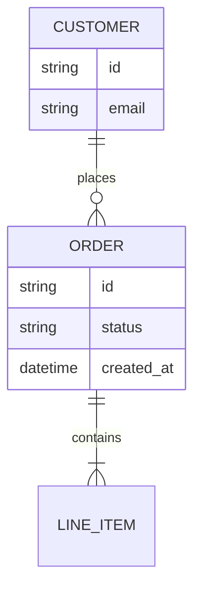
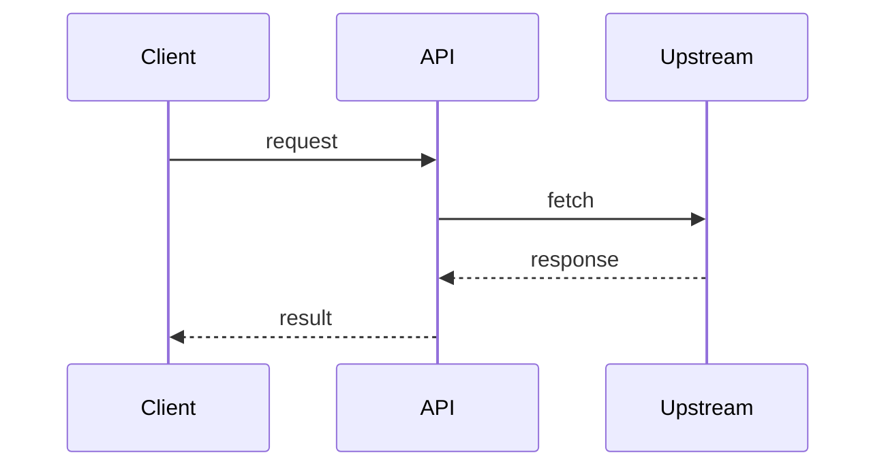

# Mermaid Templates & Validity Checklist

Two starting templates — pick one per §3 of `SKILL.md`, fill it from what was said in Steps 1–2, and don't force both diagram types for one problem.

## Entity-Relationship Template

Use when the problem is dominated by entities and their relationships.



Relationship tokens (left cardinality -- right cardinality):
- `||--||` exactly one to exactly one
- `||--o{` exactly one to zero-or-many
- `}o--o{` zero-or-many to zero-or-many
- `||--|{` exactly one to one-or-many

## Sequence Template

Use when the problem is dominated by interaction over time.



Arrow tokens:
- `->>` solid line, filled arrowhead (a call)
- `-->>` dashed line, filled arrowhead (a return/response)
- `-x` solid line, crossed end (a failed/async call with no reply)

## Validity Checklist (run before presenting)

1. First non-blank line inside the fence is exactly one diagram-type declaration (`erDiagram` or `sequenceDiagram`) — never both, never omitted.
2. Every relationship/message line has a label after `:`.
3. Entity and participant names have no spaces (use `LINE_ITEM`, not `Line Item`); use quoted aliases only where the renderer requires them.
4. Brackets and braces are balanced: `{` opened in an ER attribute block is closed before the diagram ends.
5. The fence is closed — a dangling ` ```mermaid ` block with no closing ` ``` ` renders as plain text, not a diagram.
